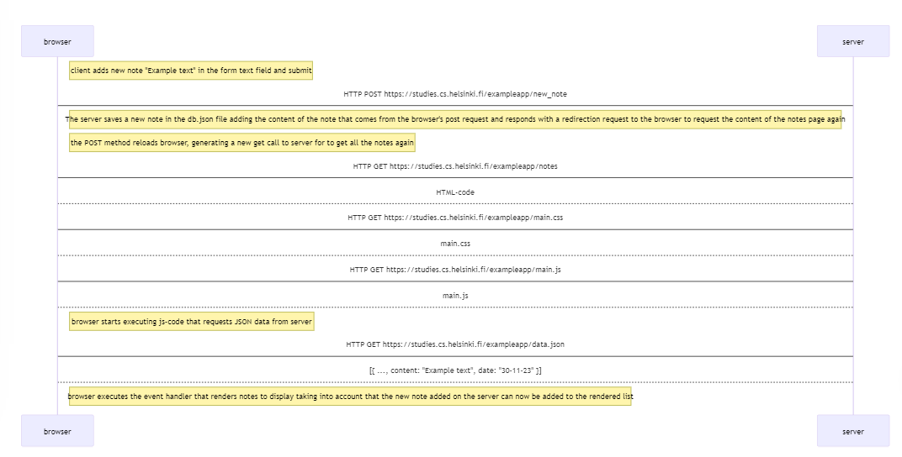

# **Fullstack Open 2023**

Soluciones implementadas para cada uno de los ejercicios del bootcamp fullstack open 2023

- [**Temas**](#temas)
    - [**Parte 0: Fundamentos de las aplicaciones web**](#parte-0-fundamentos-de-las-aplicaciones-web)
      - [0.4: Nuevo diagrama de nota](#04-nuevo-diagrama-de-nota)
      - [0.5: Diagrama de aplicación de una sola página](#05-diagrama-de-aplicación-de-una-sola-página)
      - [0.6: Nueva nota spa](#06-nueva-nota-spa)

  ## **Temas**

### **Parte 0: Fundamentos de las aplicaciones web**

#### 0.4: Nuevo diagrama de nota

Crear un diagrama similar que describa la situación en la que el usuario crea una nueva nota en la página [https://studies.cs.helsinki.fi/exampleapp/notes](https://studies.cs.helsinki.fi/exampleapp/notes) escribiendo algo en el campo de texto y haciendo clic en el botón submit.

- usuario rellena el input y se enviá la información mediante un botón llamado "save".
- el navegador envía una solicitud post con la información del formulario a la dirección "exampleapp/new_note".
- el servidor guarda la información recibida.
- el evento submit recarga el navegador realizando una nueva petición al servidor, cargado los archivos notes, main.css y main.js.

```json
sequenceDiagram
  participant browser
  participant server
  Note right of browser: client adds new note "Example text" in the form text field and submit
  browser->server: HTTP POST https://studies.cs.helsinki.fi/exampleapp/new_note
  Note left of server: The server saves a new note in the db.json file adding the content of the note that comes from the browser's post request and responds with a redirection request to the browser to request   the content of the notes page again

  Note right of browser: the POST method reloads browser, generating a new get call to server for to get all the notes again
  browser->server: HTTP GET https://studies.cs.helsinki.fi/exampleapp/notes
  server-->browser: HTML-code
  browser->server: HTTP GET https://studies.cs.helsinki.fi/exampleapp/main.css
  server-->browser: main.css
  browser->server: HTTP GET https://studies.cs.helsinki.fi/exampleapp/main.js
  server-->browser: main.js

  Note right of browser: browser starts executing js-code that requests JSON data from server
  browser->server: HTTP GET https://studies.cs.helsinki.fi/exampleapp/data.json
  server-->browser: [{ ..., content: "Example text", date: "30-11-23" }]

  Note right of browser: browser executes the event handler that renders notes to display taking into account that the new note added on the server can now be added to the rendered list
```



#### 0.5: Diagrama de aplicación de una sola página

Cree un diagrama que describa la situación en la que el usuario accede a la versión de aplicación de una sola página de la aplicación de notas en [https://studies.cs.helsinki.fi/exampleapp/spa](https://studies.cs.helsinki.fi/exampleapp/spa).

- al realizar una petición el navegador carga el archivo spa y quien tiene la estructura html.
- dentro de la estructura html se encuentra la petición main.css y spa.js.
- dentro del código de spa.js se encuentra una petición a "https://studies.cs.helsinki.fi/exampleapp/data.json", retornando el archivo data.json
- el navegador renderiza los datos en el html.

```json
sequenceDiagram
  participant browser
  participant server
  browser->server: HTTP GET https://studies.cs.helsinki.fi/exampleapp/spa
  server-->browser: HTML-code
  browser->server: HTTP GET https://studies.cs.helsinki.fi/exampleapp/main.css
  server-->browser: main.css
  browser->server: HTTP GET https://studies.cs.helsinki.fi/exampleapp/spa.js
  server-->browser: spa.js

  note right of browser: browser starts executing js-code in spa.js that fetches JSON data for notes from server
  browser->server: HTTP GET https://studies.cs.helsinki.fi/exampleapp/data.json
  server-->browser: [{" content":"Text example 1","date":"2023-11-30T20:52:21.201Z"}...]

  note right of browser: browser executes the event handler that renders notes to display creating the list of notes and deleting the previous list if there was one
```

